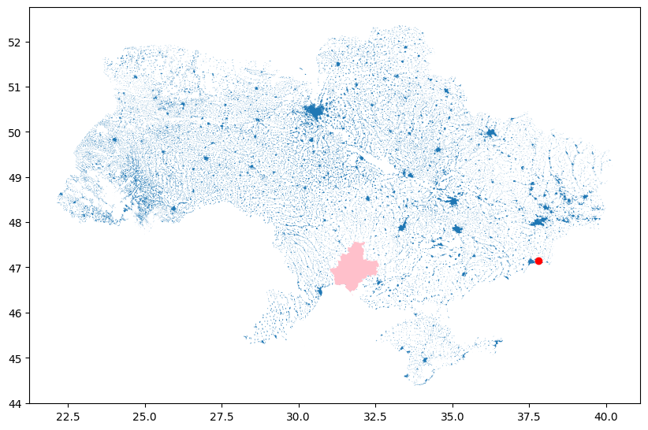

# Flashpoint-Ukraine Event Detector (FED) 

Ukraine conflict event detection through NASA FIRMS data analysis. 

## TO DO 

- research prior modeling approaches for e.g. weather, etc.. 
- settle on algorithms for the three required modeling approaches 
- incorporate elevation data, population centers, and potentially weather to provide the model with the additional information prediction -- consider what else might be salient to the prediction and scare up a data source
- decide on evaluation criteria 
- implement naive 
- implement non-deep learning approach 
- implement deep learning approach 
- compare 
- build presentation 
- record pitch 

## Problem 

The Russo-Ukrainian war has had a devastating impact on the Ukrainian and Russian peoples alike. Tactical gains and strategic maneuvering are the subject of global interest, and significant geopolitical decisions turn on assessment of the war. Non-governmental organizations seeking to reduce the humanitarian cost of the war must position themselves to deliver aid in a dynamic and potentially lethal environment. However, the preponderance of battlefield reporting is sourced from on-the-ground accounts by citizens and non-governmental organizations (NGOs). This reporting is often delayed by hours or days, complicating emergency response efforts and contributing to the fog-of-war faced by humanitarian agencies.  

Prior work assembling a cohesive dataset to support conflict event prediction resulted in the open-sourcing of the Flashpoints Ukraine Dataset (FUD). This effort fused authoritative conflict event reporting streams with NASA thermal anomaly detections. This project seeks to build an online analytic to make near-real-time predictions of Ukraine war conflict events based on the FUD, and in so doing, supplement existing battlefield reporting. This analytic may provide an improvement in situational intelligence that can be used by NGOs and first responders alike. 

## Data Sources

he primary dataset for this project is the Flashpoints Ukraine Dataset which was open-sourced in support of work completed for AIPI-510 in the Fall of 2024. A complete datasheet can be found on the companion Github site. Auxiliary elevation data will be ingested from the US Geological Survey (USGS) and can be found on the USGS website. 



## Prior Efforts 

While a number of humanitarian and governmental organizations are interested in and report on conflict events in the Ukraine, to the author’s knowledge, no prior efforts to infer conflict-related developments based on space-based thermal anomaly data have been published. Consequently, this work fills an important gap that is reinforced by Sticher et al in [1], who assert the following:  

> We call for concerted efforts to compile a large dataset of nonsensitive conflict events to accelerate research toward the remote monitoring of armed conflicts and for interdisciplinary collaboration to ensure conflict-sensitive monitoring solutions.

## Model Evaluation and Selection 


### Data Processing Pipeline 

### Models

## Repository Layout
  
## Quickstart 

All testing done with Python 3.12

1. `pip install -r requirements.txt` 

## Usage 

```
```
  
## Demo Application

## Results and Conclusions

### Challenges 

## Ethics Statement

**Data** 


**Reproducability** 


**Applications** 


## References

1. Sticher V, Wegner JD, Pfeifle B. Toward the remote monitoring of armed conflicts. PNAS Nexus. 2023 May 29;2(6):pgad181. doi: 10.1093/pnasnexus/pgad181. PMID: 37378391; PMCID: PMC10291284. 