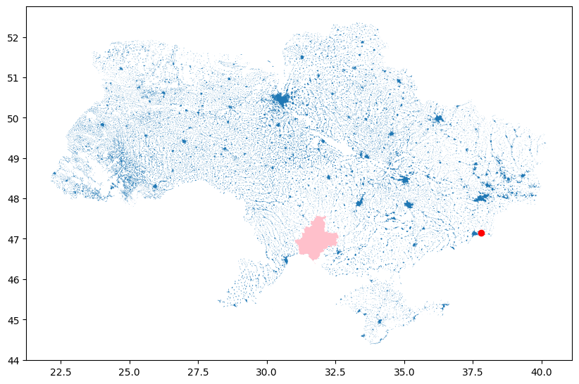

# Flashpoint-Ukraine Event Detector (FED) 

Ukraine conflict event detection through NASA FIRMS data analysis. 

## TO DO 

- implement naive 
- implement non-deep learning approach 
- implement deep learning approach 
- compare 
- build demo application 
- incorporate visualizations from jupyter plots to illustrate temporal splits
- build presentation 
- record pitch 

## Problem 

The Russo-Ukrainian war has had a devastating impact on the Ukrainian and Russian peoples alike. Tactical gains and strategic maneuvering are the subject of global interest, and significant geopolitical decisions turn on assessment of the war. Non-governmental organizations seeking to reduce the humanitarian cost of the war must position themselves to deliver aid in a dynamic and potentially lethal environment. However, the preponderance of battlefield reporting is sourced from on-the-ground accounts by citizens and non-governmental organizations (NGOs). This reporting is often delayed by hours or days, complicating emergency response efforts and contributing to the fog-of-war faced by humanitarian agencies.  

Prior work assembling a cohesive dataset to support conflict event prediction resulted in the open-sourcing of the Flashpoints Ukraine Dataset (FUD). This effort fused authoritative conflict event reporting streams with NASA thermal anomaly detections. This project seeks to build an online analytic to make near-real-time predictions of Ukraine war conflict events based on the FUD, and in so doing, supplement existing battlefield reporting. This analytic may provide an improvement in situational intelligence that can be used by NGOs and first responders alike. 

## Data Sources

he primary dataset for this project is the Flashpoints Ukraine Dataset which was open-sourced in support of work completed for AIPI-510 in the Fall of 2024. A complete datasheet can be found on the companion Github site. Auxiliary elevation data will be ingested from the US Geological Survey (USGS) and can be found on the USGS website. 



## Prior Efforts 

**Self-Exciting Point Processes**

The spatiotemporal Hawkes process "assumes additive, positive, decaying and spatially local influence over future events" [4] and From [5]: "The key property of Hawkes processes, called self-excitation, is that the occurrence of one event may trigger a series of similar events".  While a close analog in terms of its inputs, stochastic yet precise location in space and time, our latent pattern is unlikely to abide these assumptions for very intuitive reasons. Some conflict events may be inhibitory, some excitatory, some could engender responses that are postponed for various reasons by days or weeks. Thus the Hawkes process isn't appropriate for our task. 

- Analogues include crime prediction, meteorological forecasting and epidemiology. 

Examples: 
- Crime is a good analogy, as given some spatially-anchored features, we look to predict a location and an event type. Though, there is not a time-series input here to consider. In [2]: 
  - model: crime prediction is implemented using a random forest classifier 
  - spatial dimension: reduced to a 200' x 200' grid of cells
  - splits: Training data was split temporally, with two years of data serving as a training set and the subsequent two years as a test set. 
  - eval: 
    - was predictive accuracy index (PAI), which is a ratio of thresholded crime divded by the area in question
    - also Recapture Rate Index (RRI) is a simple ratio of predictions in a thresholded area over actual crimes in that same area
  - comments: 
    - not clear these are treated as self-exciting processes, and the training data just consists of the crime, not of an event that could portend or reflect a crime happening -- useful but 
- Epidemiology 
  - model : gnn
  - spatial dimension: this paper didn't use a spatial dimension, all connections were 2-hops in the graph between nodes
  - temporal dimension:7-day window
  - splits: strict temporal split, 60 contiguous days for training, 30 days for testing
  - eval: 
  - comment: epidemiology is
- Weather 
  - 

- Neural point processes for spatiotemporal data brings deep learning to the estimation problem. In [4], the problem of modeling both spatial and temporal relationships is discussed... 
  - model: transformer encoder into latent dimension, fully-connected decoder? 
  - time dimensions is sinusoidally encoded (and presumably added to the input)
  - splits: 
    - long event sequences are partitioned into non-overlapping subsequences based ona fixed time range
      - input is the series of events, minus the last 
      - target for prediction is the last event
      - number of input events varies across all subsequences
    - split into train/val/tests with a ratio of 8:1:1

- In [6], CNNs are criticized for their reliance on local features:  "convolution layers to capture the spatial dependence, which are local and inefficient"... does this bias us toward transformers? Keep some perspective here. Getting a functional prototype is more important than an optimal one. 
- In [7], the authors conclude that transfer learning is more cost effective and performant than scratch-training models for many VIT tasks ('for most practical purposes').
  - more data yields more generic models 
  - ViT-Ti is 12 layers, 192 (patches?) wide, with 768 MLP(?) width, 3 heads and 5.8M params
  - models trained on ~200x200 pixel images in imagenet -- could we dial down the resolution for our regions and shove into one of these open-source VIt models? how would we get the third dimension in? seems a bit dicey given my lack of experience with transformer architectures --- 

While a number of humanitarian and governmental organizations are interested in and report on conflict events in the Ukraine, to the author’s knowledge, no prior efforts to infer conflict-related developments based on space-based thermal anomaly data have been published. Consequently, this work fills a gap that is reinforced by Sticher et al in [1], who assert the following:  

> We call for concerted efforts to compile a large dataset of nonsensitive conflict events to accelerate research toward the remote monitoring of armed conflicts and for interdisciplinary collaboration to ensure conflict-sensitive monitoring solutions.

## Modeling Process 

### Objective 

This dataset can be applied to a variety of prediction tasks. 

1. We start with a simple classification task: classify the anomaly as associated with a battlefield event or not. If we can't make progress here the whole project is in jeopardy:
   
   - input: features associated with a single event
   - output: probability this is a conflict event
   - evaluation metrics: 
     - Precision : number of true positives over false positives
     - Recall : number of true positives over true negatives
     - F1 : 2 * P * R / (P + R)
     - AUROC : area under the ROC curve, which monitors the true positive/false positive ratio as the threshold for each is varied from 0 to 1
   - models: 
     - just as we are passing the convolutional filters over the full surface of the image, we can pass a less sophisticated model like a random forest or linear regression model over the grid, taking as inputs a configurable number of adjacent cells and their features... then emitting a single prediction (starting with binary then moving to multiclass?) 
       - how do we reconcile the differences between our detection geometry and the event? i guess the detection is going to need to span all cells it touches... we'll need a dataset builder to encode that information into our uber tensor
     - naive: hotspot: iterate over all conflict pixels, join the area - for prediction, just look to see if the fire pixel intersects with the hotspots
       - ❗️ must settle on input and output values (see treatment below), what are these?  
         - if it's just a row at a time and a classification at a time, our CNN is constrained, if it's many rows, how many? how does the classic model handle these? 
           - re splits, we have no way of deciding which events are related, we would have to model the relationships to tease out which groups could be safely split -- rely on purely temporal split, of fixed but configurable size (e.g. 20 days of input, predict the labels for each grid cell on the last day)
             - we have to remember our data is split by time already, the negative class is all before the conflict started and the positive class is all after... we need to mask the year, and probably the month as well to avoid it learn a correlation between the month the events occured and the conflic stage
         - ❗️ this also dictates our evaluation method to a degree! 
           - 
     - classic: 
       - logistic regression with detection -- but this only uses the current event, we need a method that looks across recent detections, yes? ... do we scoop all events within a window and consider these 'contemporaries' as context for the classification? if there's an arbitrary number of them, how do we translate to the fixed-size input the models require? 
         - grid -> discretize the space and bin 
         - comes back to the spatial and temporal binning --- convert the dataset to a 3d tensor : lat x long x time-slice? 
           - hang on, the model will have the benefit of all training data when it trains, and any latent patterns are up to the algorithm to memorialize. we don't need to put every model on the same footing here with respect to the intermediate representations that are constructed from the examples ... BUT we do need these to accept the same data for training, validation and testing ... a crucial aspect here is how we'll decompose the available data, and what a validation input looks like. We can't have one model expect a single row of features and another expect a full 3d tensor of recent events (i.e. multiple rows). 
         - single row is trivial for all, but if we opt for multiple rows provided at eval time, how many and of what format? leave it to the model to decide how or if to compress multiple rows, but we can't do 11th-hour pivot from 1 input row to an arbitrary number. this is the thing that must be locked in up front. 
         - another dimension, what is the label!!?? is the training data a cross validation setup where we have many subsets and we ask the model to predict e.g. day 100 after seeing 99 days of events? these can't be variable. we would have to settle on a split... and if we train on events that happen after labels, aren't we leaking that data into the model? i.e. the model could just learn to memorize information in the future that helps predict the labels of past events that are part of the validation data. 
         - another dimension, what is the label!!?? is the training data a cross validation setup where we have many of subsets and we ask the model to predict after 100 days 
         - well, it's helpful to note that we joined on dates at a day resolution --- we could just pass everything for a given date, i.e. all anomalies and have the model classify anything that's a conflict event ... but what do our models emit? it can't be a list of detections, it would have to be probabilities for all input pixels? like, 10 pixels, 10 classifications ... but 100 pixels, 100 classifications? in the case of class probabilities, that's explosive in complexity and also not obvious how to represent with a fixed-size network geometry. 
         - and how do we pass the features associated with the event? we can use the idea of channels at each layer... so our tensor goes to 4d... x, y, time and k features (intensity, wavelength, etc...) ... perhaps collapse the spatial dimension to a linear representation to avoid the fourth dimension? 
     - NN: features of detection as input? 
  
2. Next we look to improve the fidelity of the prediction, and have the model predict the class associated with the event - this doesn't make sense if we can't even do a binary classification

3. In the hopes of improving our estimation, we incorporate the intuition that the probability of a thermal anomaly should be conditioned on the prior distribution of anomalies. That is, that there is a causal relationship between past and future events. Perhaps a forest fire gave rise to another fire in an adjacent location, or a large fire eliminates the likelihood of a similarly large fire given it's consumption of available fuel at that location. Where these anomalies are driven by battlefield events, an anomaly may be predictive of a subsequent anomaly at that location as the terrain is contested, or perhaps reduces the likelihood of an event after ground is ceded and comes under the control of one of the belligerents. 
   - naive: 
   - logistic regression: 
   - 

### Data Processing Pipeline 

Each thermal anomaly is carried as a row in our dataset with the following features:

- f_lat: latitude of the center point of the thermal anomaly
- f_lng: longitude of the center point of the thermal anomaly
- f_bright: brightness temperature of the anomaly
- f_scan: length of the pixel in km in the scan direction (~east/west orientation)
- f_track: length of the pixel in km in the track direction (~north/south orientation)
- date: date of the detection and the associated conflict event
- f_acqtime: pixel acquisition time
- f_sat: spacecraft carrying the observing instrument
- f_inst: instrument responsible for the observation
- f_conf: confidence of the obsevation (normalized across the dataset to low, medium, high)
- f_bright31: secondary wavelength brightness (see FIRMS FAQ
- f_frp: pixel radiative power (see FIRMS FAQ
- f_daynight: whether this is day or night observation
- f_datetime: datetime of the observation
- geometry: estimated pixel geometry

Positive classes carrying the following labels: 

- a_event_id: unique identifier that maps to the original ACLED event row
- a_type: the type of disorder motivating the event reporting
- a_event: the major category of event
- a_subevent: the minor category of the event
- a_location: the English placename associated with the event
- a_lat: the latitude of the named location
- a_lng: the longitude of the named location
- a_geoprec: a categorical value indicating the resolution of the spatial correlation- 
- h_adm_en: administrative place name, transliterated into English
- h_adm_ua: administrative place name, in Ukrainian
- h_adm_shape: polygon(s) associated with the named administrative boundary
- geometry: the geometry of the smallest admin shape associated with the conflict event


Essential nature of masking the date, lat/long, to avoid models memorizing contested areas

### Evaluation 
- MSE for lat/long
- AUROC? 
- softmax-driven probability for all event types
- 
### Models

#### Naive

- iterate over cells, ignoring history and keeping track of the proportion of pixels in each grid square that are conflict vs not
- predict: report the probability for the pixel 
- eval: precision, recall, 
- notes
  - this global awareness gives the naive model a significant advantage -- how do we provide to our other models as well? 

#### Classic/shallow NN 

- logistic regression? 
- random forests? 
  - how do we incorporate temporal component? allow the network to look back some number of features in time (as features) 
- lack of global awareness 

#### Deep NN

- GNNs? The graph could correspond to a map with edges being roads? ... eh, then I'm building a dataset again. 
- RNN? 
- CNN
  - 2d map with time serving as a 3rd dimension
  - decompose time and space into grid cells and do 3d convolutions, the size of each cell (h&w for spatial and duration for time) are both hyperparameters... this allows us to start with extremely coarse values to get a feel for behavior (and evaluation!), then increase the resolution as we gain confidence (and find more compute!)
  - employ skip connections to ensure granular spatial relationships are translated to later layers/
  - mask all prior events to ensure predictions can onl  
  - 
- vision transformer, also operating over 3d dimensions? attention mechanism could be costly... CNN gets us efficiency 

## Repository Layout
  
## Quickstart 

All testing done with Python 3.12

1. `pip install -r requirements.txt` 

## Usage 

```
```
  
## Demo Application

## Results and Conclusions

Critique: 
- The reporting on Ukraine conflict events is necessarily incomplete, thought the extent to which this is true is unknown. Timestamp fidelity, misreported locations, and event omissions carried through in the training data resultin a flawed model. 
- The relatively low resolution of the FIRMS detections, the overflight characteristics, the impact of cloud cover, etc.. suggest a non-trivial number of interesting anomalies are not captured here... leading to further challenges in faithfully representing developments on the ground which we pass to the modeling algorithm


### Challenges 

## Ethics Statement

**Data** 


**Reproducability** 


**Applications** 
- The compounding effect of undetected events, misattributed events, incorrectly reported timestamps, etc... result in a dataset that we should be skeptical of. Yet, in one respect we can appreciate that the models are better than a random guess about whether an event is a conflict event. Interpretation of these results is not straightforward. At best these predictions can serve to augment situational awareness and anticipatory logistics. At worst, these predictions could complicate the planning activities of first-responders or be used to support kinetic operations by belligerents. 

## References

1. Sticher V, Wegner JD, Pfeifle B. Toward the remote monitoring of armed conflicts. PNAS Nexus. 2023 May 29;2(6):pgad181. doi: 10.1093/pnasnexus/pgad181. PMID: 37378391; PMCID: PMC10291284. 
2. Wheeler, A.P., Steenbeek, W. Mapping the Risk Terrain for Crime Using Machine Learning. J Quant Criminol 37, 445–480 (2021). https://doi.org/10.1007/s10940-020-09457-7
3. Kapoor, A., Ben, X., Liu, L., Perozzi, B., Barnes, M., Blais, M., & O'Banion, S. (2020). Examining covid-19 forecasting using spatio-temporal graph neural networks. arXiv preprint arXiv:2007.03113.
4. Zhou, Z., Yang, X., Rossi, R., Zhao, H. &amp; Yu, R.. (2022). Neural Point Process for Learning Spatiotemporal Event Dynamics. <i>Proceedings of The 4th Annual Learning for Dynamics and Control Conference</i>, in <i>Proceedings of Machine Learning Research</i> 168:777-789 Available from https://proceedings.mlr.press/v168/zhou22a.html.
5. https://www.annualreviews.org/docserver/fulltext/statistics/12/1/annurev-statistics-112723-034304.pdf?expires=1753931296&id=id&accname=guest&checksum=BD1B38A87D9CC1AE6FD14DCE0743E20C
6. Lin, Z., Li, M., Zheng, Z., Cheng, Y., & Yuan, C. (2020). Self-Attention ConvLSTM for Spatiotemporal Prediction. Proceedings of the AAAI Conference on Artificial Intelligence, 34(07), 11531-11538. https://doi.org/10.1609/aaai.v34i07.6819
7. Steiner, A., Kolesnikov, A., Zhai, X., Wightman, R., Uszkoreit, J., & Beyer, L. (2021). How to train your vit? data, augmentation, and regularization in vision transformers. arXiv preprint arXiv:2106.10270.
