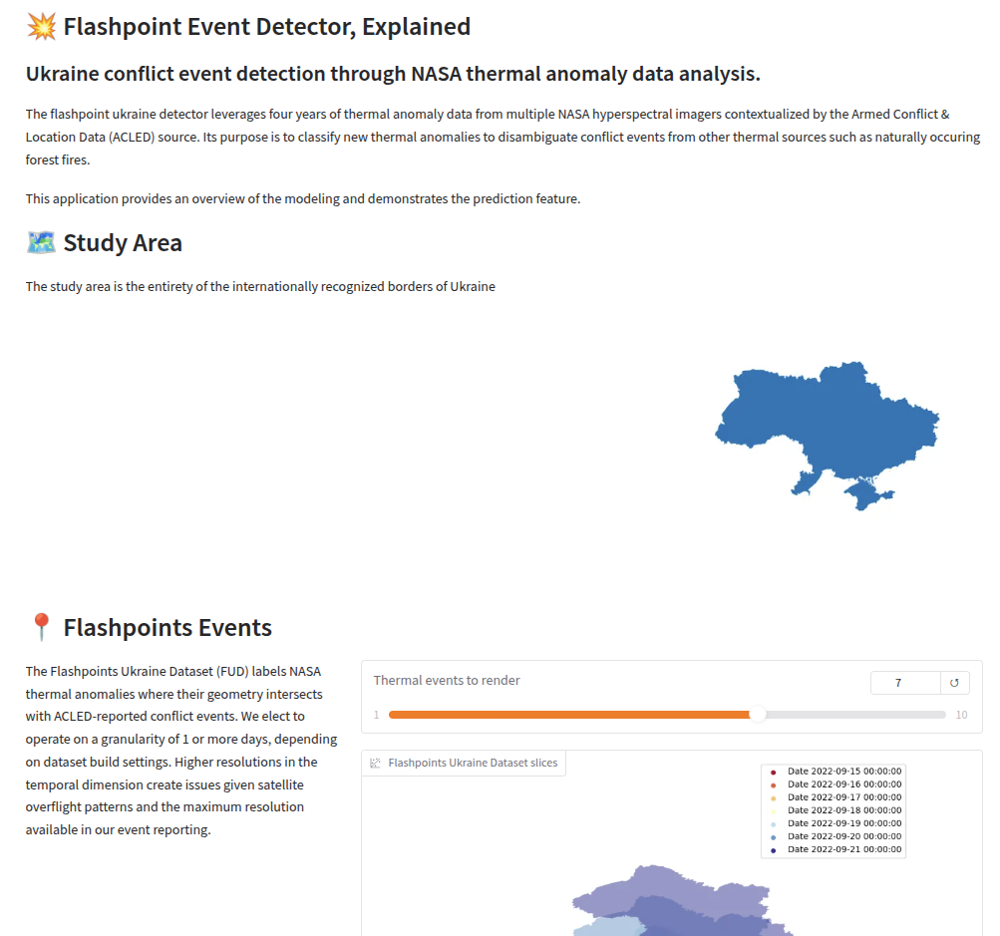

# Flashpoint-Ukraine Event Detector (FED) 

Ukraine conflict event detection through NASA FIRMS data analysis. 

## TO DO 

- implement classic method
- build demo application 
- incorporate visualizations from jupyter plots to illustrate temporal splits
- build presentation 
- record pitch 

## Problem 

The Russo-Ukrainian war has had a devastating impact on the Ukrainian and Russian peoples alike. Tactical gains and strategic maneuvering are the subject of global interest, and significant geopolitical decisions turn on assessment of the war. Non-governmental organizations seeking to reduce the humanitarian cost of the war must position themselves to deliver aid in a dynamic and potentially lethal environment. However, the preponderance of battlefield reporting is sourced from on-the-ground accounts by citizens and non-governmental organizations (NGOs). This reporting is often delayed by hours or days, complicating emergency response efforts and contributing to the fog-of-war faced by humanitarian agencies.  

Prior work assembling a cohesive dataset to support conflict event prediction resulted in the open-sourcing of the Flashpoints Ukraine Dataset (FUD). This effort fused authoritative conflict event reporting streams with NASA thermal anomaly detections. This project seeks to build an online analytic to make near-real-time predictions of Ukraine war conflict events based on the FUD, and in so doing, supplement existing battlefield reporting. This analytic may provide an improvement in situational intelligence that can be used by NGOs and first responders alike. 

## Data Sources

The primary dataset for this project is the Flashpoints Ukraine Dataset which was open-sourced in support of work completed for AIPI-510 in the Fall of 2024. A complete datasheet can be found on the companion Github site. Auxiliary elevation data will be ingested from the US Geological Survey (USGS) and can be found on the USGS website. 


## Prior Efforts 

Finding analogs for this problem was not difficult, though there are no perfect matches. 

**Note on Self-Exciting Point Processes**

The spatiotemporal Hawkes process "assumes additive, positive, decaying and spatially local influence over future events" [4] and From [5]: "The key property of Hawkes processes, called self-excitation, is that the occurrence of one event may trigger a series of similar events".  While a close analog in terms of its inputs, stochastic yet precise location in space and time, our latent pattern is unlikely to abide these assumptions for very intuitive reasons. Some conflict events may be inhibitory, some excitatory, some could engender responses that are postponed for various reasons by days or weeks. Thus the Hawkes process isn't appropriate for our task. 

**Domain-Specific Approaches** 
- Analogues include crime prediction, meteorological forecasting and epidemiology. 

Examples: 
- Crime is a good analogy, as given some spatially-anchored features, we look to predict a location and an event type. Though, there is not a time-series input here to consider. In [2] we see crim prediction happening on the spatial dimension and splits in the temporal. Varios models and domain-specific criteria are applied that aren't a great match. 
- Epidemiology has plenty of prior art, including with general deep learning and GNNs. 
- Meteorology: 
- Neural point processes for spatiotemporal data brings deep learning to the estimation problem. In [4], the problem of modeling both spatial and temporal relationships is discussed. An encoder-only transformer is matched to a fully connected decoder. Time is sinusoidally encoded (and presumably added to the input). 
- In [6], CNNs are criticized for their reliance on local features:  "convolution layers to capture the spatial dependence, which are local and inefficient"... does this bias us toward transformers? Keep some perspective here. Getting a functional prototype is more important than an optimal one. 
- In [7], the authors conclude that transfer learning is more cost effective and performant than scratch-training models for many VIT tasks ('for most practical purposes').

While a number of humanitarian and governmental organizations are interested in and report on conflict events in the Ukraine, to the author’s knowledge, no prior efforts to infer conflict-related developments based on space-based thermal anomaly data have been published. Consequently, this work fills a gap that is reinforced by Sticher et al in [1], who assert the following:  

> We call for concerted efforts to compile a large dataset of nonsensitive conflict events to accelerate research toward the remote monitoring of armed conflicts and for interdisciplinary collaboration to ensure conflict-sensitive monitoring solutions.

## Modeling Process 

### Objective 

This dataset can be applied to a variety of prediction tasks. We elect to classify the anomaly as being associated with a battlefield event or not. 

In the hopes of improving our estimation, we incorporate the intuition that the probability of a thermal anomaly should be conditioned on the prior distribution of anomalies. That is, that there is a causal relationship between past and future events. Perhaps a forest fire gave rise to another fire in an adjacent location, or a large fire eliminates the likelihood of a similarly large fire given it's consumption of available fuel at that location. Where these anomalies are driven by battlefield events, an anomaly may be predictive of a subsequent anomaly at that location as the terrain is contested, or perhaps reduces the likelihood of an event after ground is ceded and comes under the control of one of the belligerents. 

### Data Processing Pipeline 

Each thermal anomaly is carried as a row in our dataset with the following features:

- f_lat: latitude of the center point of the thermal anomaly
- f_lng: longitude of the center point of the thermal anomaly
- f_bright: brightness temperature of the anomaly
- f_scan: length of the pixel in km in the scan direction (~east/west orientation)
- f_track: length of the pixel in km in the track direction (~north/south orientation)
- date: date of the detection and the associated conflict event
- f_acqtime: pixel acquisition time
- f_sat: spacecraft carrying the observing instrument
- f_inst: instrument responsible for the observation
- f_conf: confidence of the obsevation (normalized across the dataset to low, medium, high)
- f_bright31: secondary wavelength brightness (see FIRMS FAQ
- f_frp: pixel radiative power (see FIRMS FAQ
- f_daynight: whether this is day or night observation
- f_datetime: datetime of the observation
- geometry: estimated pixel geometry

Positive classes carrying the following labels: 

- a_event_id: unique identifier that maps to the original ACLED event row
- a_type: the type of disorder motivating the event reporting
- a_event: the major category of event
- a_subevent: the minor category of the event
- a_location: the English placename associated with the event
- a_lat: the latitude of the named location
- a_lng: the longitude of the named location
- a_geoprec: a categorical value indicating the resolution of the spatial correlation- 
- h_adm_en: administrative place name, transliterated into English
- h_adm_ua: administrative place name, in Ukrainian
- h_adm_shape: polygon(s) associated with the named administrative boundary
- geometry: the geometry of the smallest admin shape associated with the conflict event

Masking the date and lat/long was done to avoid models memorizing contested areas and regurgitating their coordinates. 

### Evaluation 

- Accuracy for baseline training and early feedback 
- F1 score for late-stage comparison 

## Repository Layout
  
## Quickstart 

All testing done with Python 3.12

1. `pip install -r requirements.txt` 

## Usage 

**Build a dataset** 

```
 python -m fed build --sample-n 1000 --tag test --spatial-step 0.1
Retrieving FUD from Kaggle (force=False)...
Done. Path to local dataset files: flashpoint-ukraine-dataset/versions/1/fud.gpkg
Loading geopackage....
Loaded FUD, with coordinate system EPSG:4326
Longitude steps @ 181, latitude @ 80, and time @ 1485
Discretizing dataset at 0.1 decimal degree (11.10 km) and 1 day resolution. This will create a grid of 181 x 80 x 1485 (21,502,800 cells).
Training aperture will be 20 steps square (222.00 kmtotal and 7 steps long (7 days)).
100%|█████████████████████████████████████████████████████| 135050/135050 [00:04<00:00, 27331.44it/s]
Sampling 1000 stories from the pre-war period (2020-09-01 00:00:00 - 2022-02-01 00:00:00,518 days total) and 1000 stories from the post-invasion period 2022-02-23 00:00:00 - 2024-09-24 00:00:00.
100%|█████████████████████████████████████████████████████████| 2000/2000 [00:00<00:00, 51745.44it/s]
Generation complete!
Wrote 'test' FED dataset to data/.
```

**Train** 

```
$ python -m fed train --type neural --data-tag test --nn-epochs 4
Loading FED from data/... 
Splitting dataset with val @ 10, test @ 10... 
Done! Post-split counts:
 - (1980 training stories)
 - (10 val stories)
 - (10 test stories)

Logging tensorboard output to ./runs
Starting training run...
100%|█████████████████████████████████████████████████████████████████████████████████████| 1980/1980 [00:46<00:00, 42.78it/s]
100%|█████████████████████████████████████████████████████████████████████████████████████| 1980/1980 [00:45<00:00, 43.39it/s]
100%|█████████████████████████████████████████████████████████████████████████████████████| 1980/1980 [00:45<00:00, 43.56it/s]
100%|█████████████████████████████████████████████████████████████████████████████████████| 1980/1980 [00:45<00:00, 43.45it/s]
100%|███████████████████████████████████████████████████████████████████████████████████████████| 4/4 [03:02<00:00, 45.73s/it]
Training complete!
Model saved to models/nn.pt
```

**Deploy** 

```
$ python -m fed deploy --data-tag=test
Loading FED from data... 
Retrieving FUD from Kaggle (force=False)...
Done. Path to local dataset files: /home/grim/.cache/kagglehub/datasets/justanotherjason/flashpoint-ukraine-dataset/versions/1/fud.gpkg
Loading geopackage....
Loaded FUD, with coordinate system EPSG:4326
/home/grim/projects/school/flashpoint-detector/venv/lib/python3.12/site-packages/pyogrio/raw.py:198: RuntimeWarning: organizePolygons() received a polygon with more than 100 parts. The processing may be really slow.  You can skip the processing by setting METHOD=SKIP, or only make it analyze counter-clock wise parts by setting METHOD=ONLY_CCW if you can assume that the outline of holes is counter-clock wise defined
  return ogr_read(
* Running on local URL:  http://127.0.0.1:7860
* To create a public link, set `share=True` in `launch()`.
```
  
## Demo Application



## Results and Conclusions

Critique: 
- The reporting on Ukraine conflict events is necessarily incomplete, thought the extent to which this is true is unknown. Timestamp fidelity, misreported locations, and event omissions carried through in the training data resultin a flawed model. 
- The relatively low resolution of the FIRMS detections, the overflight characteristics, the impact of cloud cover, etc.. suggest a non-trivial number of interesting anomalies are not captured here... leading to further challenges in faithfully representing developments on the ground which we pass to the modeling algorithm


### Challenges 

## Ethics Statement

**Data** 

Data Data from a prior academic effort by the author resulted in the Flashpoints Ukraine Dataset (FUD), on which the Flashpoints Event Detector (FED) is based. The former has an elaborate datasheets-for-datasets-style manifest, which attends to many of the underlying opportunities and issues with the FUD. Portions of the FED are sourced from NASA's FIRMS portal and ACLED's conflict database and information on the sourcing and veracity of those tributaries should be sought from their publisher. ​

**Abuse** 

Abuse While the FED doesn't represent a milestone achievement in spatiotemporal prediction strategies or set a new bar for curation rigor, the potential nonetheless exists for the system to be used in a way that could perpetual the horrific and continually mounting costs in the Ukraine. Belligerents, saboteurs and propagandists could tune the model and its twin dataset to help further their agendas. The author hopes any downstream uses are counter to this, and improve the lives of those who continue to carry the consequences of the ongoing conflict.​

**Reproducability** 

Reproducibility The code written in this project is the author's work. Code snippets sourced from articles, tutorials and large-language model chat sessions are annotated in the source code where appropriate. All results here are reproducible freely, without any licensing implications. The source is made available under an MIT license. ​

**Applications** 

The compounding effect of undetected events, misattributed events, incorrectly reported timestamps, etc... result in a dataset that we should be skeptical of. Yet, in one respect we can appreciate that the models are better than a random guess about whether an event is a conflict event. Interpretation of these results is not straightforward. At best these predictions can serve to augment situational awareness and anticipatory logistics. At worst, these predictions could complicate the planning activities of first-responders or be used to support kinetic operations by belligerents. 

## References

1. Sticher V, Wegner JD, Pfeifle B. Toward the remote monitoring of armed conflicts. PNAS Nexus. 2023 May 29;2(6):pgad181. doi: 10.1093/pnasnexus/pgad181. PMID: 37378391; PMCID: PMC10291284. 
2. Wheeler, A.P., Steenbeek, W. Mapping the Risk Terrain for Crime Using Machine Learning. J Quant Criminol 37, 445–480 (2021). https://doi.org/10.1007/s10940-020-09457-7
3. Kapoor, A., Ben, X., Liu, L., Perozzi, B., Barnes, M., Blais, M., & O'Banion, S. (2020). Examining covid-19 forecasting using spatio-temporal graph neural networks. arXiv preprint arXiv:2007.03113.
4. Zhou, Z., Yang, X., Rossi, R., Zhao, H. &amp; Yu, R.. (2022). Neural Point Process for Learning Spatiotemporal Event Dynamics. <i>Proceedings of The 4th Annual Learning for Dynamics and Control Conference</i>, in <i>Proceedings of Machine Learning Research</i> 168:777-789 Available from https://proceedings.mlr.press/v168/zhou22a.html.
5. https://www.annualreviews.org/docserver/fulltext/statistics/12/1/annurev-statistics-112723-034304.pdf?expires=1753931296&id=id&accname=guest&checksum=BD1B38A87D9CC1AE6FD14DCE0743E20C
6. Lin, Z., Li, M., Zheng, Z., Cheng, Y., & Yuan, C. (2020). Self-Attention ConvLSTM for Spatiotemporal Prediction. Proceedings of the AAAI Conference on Artificial Intelligence, 34(07), 11531-11538. https://doi.org/10.1609/aaai.v34i07.6819
7. Steiner, A., Kolesnikov, A., Zhai, X., Wightman, R., Uszkoreit, J., & Beyer, L. (2021). How to train your vit? data, augmentation, and regularization in vision transformers. arXiv preprint arXiv:2106.10270.
